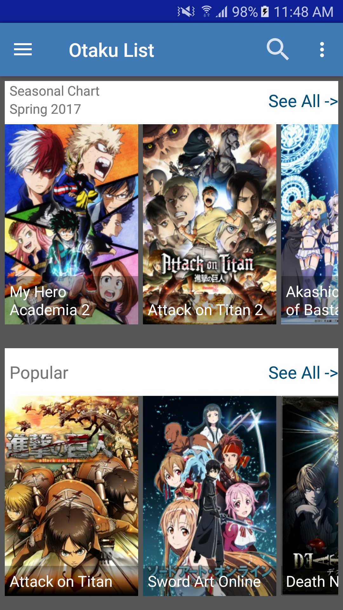

<h2><b>Otaku List: Android App</b></h2>  

Otaku List is an app for all the otakus out there looking to manage their current watch list.
This app will help you keep count of all the series you are following and is in sync with a online anime database.
It's great for discovering new series too and keeps you informed about the latest series.
It will also allow you to set reminders for a show incase you forget to watch it on TV.

Note:
This (unofficially) uses the ANILIST API and Database.
https://anilist.co/

<b>Features:</b>
- Save the anime you are watching to lists comprising various categories.
- Keep track of the no. of episodes you have watched.
- Discover the most popular anime as well as trending series.
- Set Reminders for your series.

<b>Screenshots</b>
 

 
<b>Developer's Comments:</b>

This app is officialy my first attempt at a full-blown app and although to be honest this has been a bit of an efort it was a learning oppurtunity and I thoroughly enjoyed making an app so close to my hobbies.
